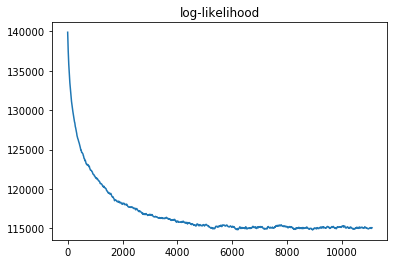

# Notes

## 2019-08-02

Tested multipying a vector with the players matrix (large sparse matrix with 1000 columns and 10 non-zero values per row). As expected, the sparse row format works well with this data.

    641      1513    1036286.0    684.9      0.1              minus_inv_cov_mat2 = scipy.sparse.bsr_matrix(minus_inv_cov_mat)
    642      1513     109381.0     72.3      0.0              prior_lprob_hessian_p = minus_inv_cov_mat2 @ p
    643      1513     297690.0    196.8      0.0              minus_inv_cov_mat2 = scipy.sparse.coo_matrix(minus_inv_cov_mat)
    644      1513     109948.0     72.7      0.0              prior_lprob_hessian_p = minus_inv_cov_mat2 @ p
    645      1513     569503.0    376.4      0.0              minus_inv_cov_mat2 = scipy.sparse.csc_matrix(minus_inv_cov_mat)
    646      1513     100190.0     66.2      0.0              prior_lprob_hessian_p = minus_inv_cov_mat2 @ p
    647      1513     510279.0    337.3      0.0              minus_inv_cov_mat2 = scipy.sparse.csr_matrix(minus_inv_cov_mat)
    648      1513     100316.0     66.3      0.0              prior_lprob_hessian_p = minus_inv_cov_mat2 @ p
    649      1513    2859365.0   1889.9      0.2              minus_inv_cov_mat2 = scipy.sparse.dia_matrix(minus_inv_cov_mat)
    650      1513     166325.0    109.9      0.0              prior_lprob_hessian_p = minus_inv_cov_mat2 @ p
    651      1513 1222742307.0 808157.5     91.9              minus_inv_cov_mat2 = scipy.sparse.dok_matrix(minus_inv_cov_mat)
    652      1513   55435132.0  36639.2      4.2              prior_lprob_hessian_p = minus_inv_cov_mat2 @ p
    653      1513   27084943.0  17901.5      2.0              minus_inv_cov_mat2 = scipy.sparse.lil_matrix(minus_inv_cov_mat)
    654      1513   19529244.0  12907.6      1.5              prior_lprob_hessian_p = minus_inv_cov_mat2 @ p

We are now fitting the full 5,000 match dataset in four minutes!

    $ time kernprof -l src/scripts/fit.py --method newton --scale 1 newton_fit_ti9.dill 
    Starting...
    Iteration.
    Iteration.
    Iteration.
    Iteration.
    Iteration.
    Iteration.
    Iteration.
    Iteration.
    Iteration.
    Iteration.
    Iteration.
    Iteration.
    Iteration.
    Iteration.
    Iteration.
    Iteration.
    Iteration.
    Iteration.
    Optimization terminated successfully.
             Current function value: -124344.356934
             Iterations: 18
             Function evaluations: 19
             Gradient evaluations: 36
             Hessian evaluations: 9200
    Wrote profile results to fit.py.lprof
    
    real	2m21.133s
    user	4m4.251s
    sys	0m25.889s

The following two hard to further optimize lines consume most of the time.

    574     18525      29337.0      1.6      0.1                      scipy.stats.multivariate_normal.logpdf(cur_skills,
    575     18525   32946603.0   1778.5     92.7                                                             cov=cov_mats[k]))  # ~ 33 seconds
    
    649      9200   76918388.0   8360.7     86.1              prior_lprob_hessian_p = minus_inv_cov_mat @ p  # ~ 77 seconds

By avoiding the `scipy.stats.multivariate_normal.logpdf()` call, we are shaving another 40 seconds off.

    ...
    Iteration.
    Optimization terminated successfully.
             Current function value: -124344.356934
             Iterations: 18
             Function evaluations: 19
             Gradient evaluations: 36
             Hessian evaluations: 9200
    Wrote profile results to fit.py.lprof
    
    real	1m55.819s
    user	3m20.333s
    sys	0m18.136s

    573                                                           # skill_prior_lprobs.append(
    574                                                           #     scipy.stats.multivariate_normal.logpdf(cur_skills,
    575                                                           #                                            cov=cov_mats[k]))
    576     18525     211987.0     11.4      4.3                  x = inv_sd_mats[k] @ cur_skills
    577     18525      13341.0      0.7      0.3                  abs_det = abs_log_dets[k]
    578     18525    3183719.0    171.9     64.1                  temp = np.sum(scipy.stats.norm.logpdf(x)) - 0.5 * abs_det
    579     18525      22310.0      1.2      0.4                  skill_prior_lprobs.append(temp)

## 2019-07-29

Despite now saving the transformed values at each iteration, sampling rate is still 100 iterations per 29 seconds (tested once on a notebook). So not too much affected.

### Deriving the Hessian function.

Our parameter vector contains of $n + 1$ values. $n$ of these form a skills vector (that fill a skills matrix column by column). The final value is the current Radiant advantage column.

For the skills vector, the Hessian matrix can be decomposed into two components: the prior probability and the match likelihood.

The prior probability Hessian matrix is just a block diagonal matrix composed of the inverse of covariance matrices; see [Gradient and Hessian of the posterior probability](#Gradient-and-Hessian-of-the-posterior-probability.). The final value of this matrix, $H_{n+1, n+1}^\text{prior}$, is simply $\frac{-1}{\text{self.radi_prior_sd}^2}$.

The match log-likelihood part of the Hessian, $H^\text{match}$, is a bit more complicated. This is also a $(n+1) \times (n+1)$ matrix. Let $\sigma(d) = \frac{1}{1 + \exp(-d / l)}$, where $d$ is the skill difference and $l$ is the logistic scaling factor. The twice differentiated match log-likelihoods with respect to parameters $i$ and $j$ is the following.

$$\frac{\partial^2 \text{match logliks}}{\partial x_i \partial x_j} = \sum_{\text{match } m} -\frac{s_{i, m} s_{j, m}}{l^2} (\sigma(d)(1 - \sigma(d))),$$

where $s_{i, m}$ is 1 or 0 depending on whether parameter $i$ is Radiant or Dire in match $m$.

It's noteworthy that each skill participates only in one match, and each match is affected by ten skills and the Radiant advantage parameter.

Thus, in each row $i$ of $H^\text{match}$ but the last one, all but 11 values are zero: the ten values corresponding to the ten skills participating in the match where skill $i$ is, plus the radiant advantage term. The sign of these non-zero values must be multiplied with dot product with the input vector $p$. Thus, for each row $i$, we need two arrays.

* An index array $index_i$ indicating all the players in the current match.
* A sign array, $sign_i$ indicating the side of each respective player.

We also need an overall length $n$ sign vector for each row $i$. Then, $(H^\text{match} p)_i = -\frac{(\sigma(d)(1 - \sigma(d)))}{l^2}\sum sign_i \times p[index_i]$.

## 2019-07-26

By calculating log-prior probability change based on a state change without explicitly computing the log determinant term (which cancels out), we now get to <1 seconds per iteration.

After additional optimisation, which mostly involves writing out scipy.stats functions and abandoning their checks, the time spent on 100 iterations is:

scipy version | time used (seconds) | mean
--------------|---------------------|----- 
`1.2.1-py37_blas_openblash486cb9f_0` | 38, 33, 43, 43, 37 | 38.8
`1.3.0-py37hab3da7d_0` | 37, 38, 38, 33, 34 | 36

We are getting just shy of 3 iterations per second.

A notebook run yielded 0.235 seconds per iteration. Compared with the non-optimised rate of 4.8 seconds per iteration, this is a 20-fold improvement.

The model likelihood saturates after around 5000 iterations.



On an Amazon instance c5.xlarge, running 100 iterations took precisely 17 seconds on five separate runs.

## 2019-07-25

Added sampling for the radiant advantage.

After refactoring and "optimisation", the speed per iteration is ~1 second. Based on line profiling, all the time is spent on sampling or taking the likelihood of standard multivariate normal distributions.

## 2019-07-23

One more note to yesterdays computations. For the exponential Gaussian process, the covariance function is $cov(x_i, x_j) = \exp(-\frac{|x_i - x_j|}{su}) = \exp(-\frac{|x_i - x_j|}{s})^{1/u}$. Thus, 

## 2019-07-22

Overnight run of the full match dataset (= 5000 matches up to TI9 qualifiers). Rate: 5515 iterations / 7h 21min 23sec = 4.8 sec / iteration.

Code should be optimised by performing a minimum amount matrix multiplications. This is done by random walking the per-sample skills vectors using a standard multivariate normal. The only time the actual skills are needed is when we need to compute the match probabilities.

If $X$ is a $k$ length multivariate normal distribution (column) vector with a covariance matrix of $\Sigma = AA^\top$, then $X \sim AZ$, where $Z \sim \mathcal{N}(\vec{0}, I)$.

We can keep random walking in this "standard normal" space. When needed to compute match likelihoods, a one-off transformation can be performed using a *precomputed and prestored* matrix $A$.

The log density of a multivariate normal distribution is the following.

$$\frac{\exp(-\frac{1}{2}X^\top \Sigma^{-1} X)}{\sqrt{(2\pi)^k |\Sigma|}}$$

Thus, the log-likelihood of $X$ is:

$$-\frac{1}{2} X^\top (AA^\top)^{-1} X - \frac{1}{2} \log((2\pi)^k |\Sigma|)$$

$$= -\frac{1}{2} Z^\top A^\top (A^\top)^{-1} A^{-1} AZ - \frac{1}{2} (\log((2\pi)^k + \log |\Sigma|)$$

$$= -\frac{1}{2} Z^\top I Z - \frac{1}{2} \log(2\pi)^k - \frac{1}{2} \log |\Sigma| $$

$$= P(Z) - \frac{1}{2} \log |\Sigma|$$

Therefore, we can just take the standard normal log-likelihood and subtract precomputed $\log |\Sigma|$.

Secondly, an array should be kept with the running sums of the match skill differences (including Radiant advantage). This way, match differences can be updated simply by updating the changed player values, without having to sum over the unchanged skills.

## 2019-07-21

Next steps:

* Have a high scaling factor for the logistic model to allow more disparity between teams. Essentially, reduce the effect of regularisation.
* Optimise speed.
* Simplify code - by default represent skills column-by-column as opposed to row by row.

Also, it seems like drawing random multivariate normal samples is slower than drawing a random standard multivariate normal, then multiplying it with a precomputed Cholesky decomposed matrix.

## 2019-07-19

Previous attempt on MCMC sampling of the model was marred by a poor proposal distribution that proposed samples that were highly implausible for the covaried normal distributions.

Here is a proposal distribution $q()$ that should work better. We know that if a multivariate normal $X \sim \mathcal{N}(0, \Sigma)$, then $X = AZ$, where $Z \sim \mathcal{N}(0, I)$ and $\Sigma = AA^T$. Equivalently then, $A^{-1}X = Z$. Since $A^{-1}X$ has no covariance, a standard normal proposal distribution should cause no problem. This is equivalent drawing a sample from $Z = z$ and proposing a move of $X \rightarrow X + Az$. Due to the transformation by $A$, the proposed moves take into account the covariance pattern of X, resulting in proposals that are "consistent" with the correlation pattern of X. Yet, the proposal distribution is fully symmetrix, since $q(X+Az \mid X) = \Pr(Z = z) = \Pr(Z = -z) = q(X \mid X + Az)$.

Or even better, we could just draw the next move from $\mathcal{N}(0, \Sigma)$.

## 2019-07-17

In commit `bff2c81f43eaafe8747fcbfeaed5d64d2b97bef4`, the Gaussian process works and is able to perform Metropolis-Hastings sampling on a small dataset with increasing likelihood. See [this notebook](notebooks/02-test_gp_hyperparams.20190718.ipynb).

However, due to the Gaussian process constraints and the information-poor nature of the per-game outcomes, the sampling is completely dominated by the Gaussian prior and not at all by the match outcomes.

An improved approach might be to first find the maximum a posteriori (MAP) of the model, the sample around it using Metropolis-Hastings.

An initial attempt to brute force the fit using BFGS failed. On a small TI9 qualifers dataset, BFGS fitting did not complete after more than 10 hours.

Separately, line profiling was performed on [a script](src/scripts/fit_ti9.py) that fitted the GP on the same TI9 dataset. The results show that computing the multivariate Gaussian log-probability density function consumes the majority of the time during fitting. Since this function is implemented in `scipy.stats.multivariate_normal`, it is unclear how this function could be sped up.

An alternative fitting method might be Newton-conjugate descent (Newton-CG), with the following reasoning. The logarithm of the Bayes formula's numerator for a vector of a player's skills at each match, $\vec{x}$, is

$$\log P(\vec{x} \mid \vec{\mu}, \Sigma) + \sum_{m \text{ in matches}} \log P(\text{outcome}_m \mid \text{skill difference}_m)$$

### Gradient and Hessian of the posterior probability.

The gradient can be computed separately for each term. For the prior probability part, the gradient is simply $\Sigma^{-1} \vec{x}$ ([source](https://stats.stackexchange.com/questions/90134/gradient-of-multivariate-gaussian-log-likelihood)). In the code, we can compute this efficiently using

```python
block_diag_mat = scipy.linalg.block_diag(
    [numpy.linalg.inv(M) for M in self.cov_mat])
return block_diag_mat @ self.skills.T
```

The Hessian of the multivariate normal (w.r.t. means) is simply $-\Sigma^{-1}$ ([source](https://stats.stackexchange.com/questions/27436/how-to-take-derivative-of-multivariate-normal-density)).

In terms of the likelihood with regards to match outcomes, the Jacobian and the Hessian for logistic regression can be found [here](https://stats.stackexchange.com/questions/68391/hessian-of-logistic-function).

With the gradient and the Hessian, the Newton-Raphson method can be used for finding the MAP. 
